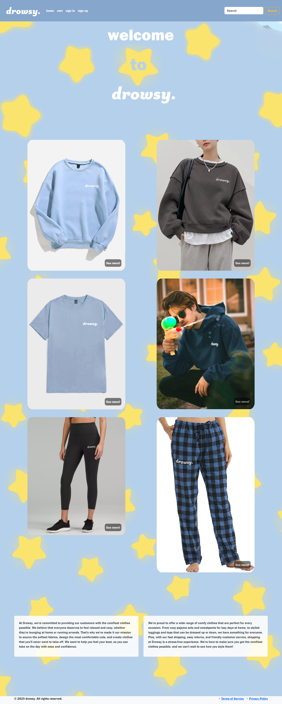
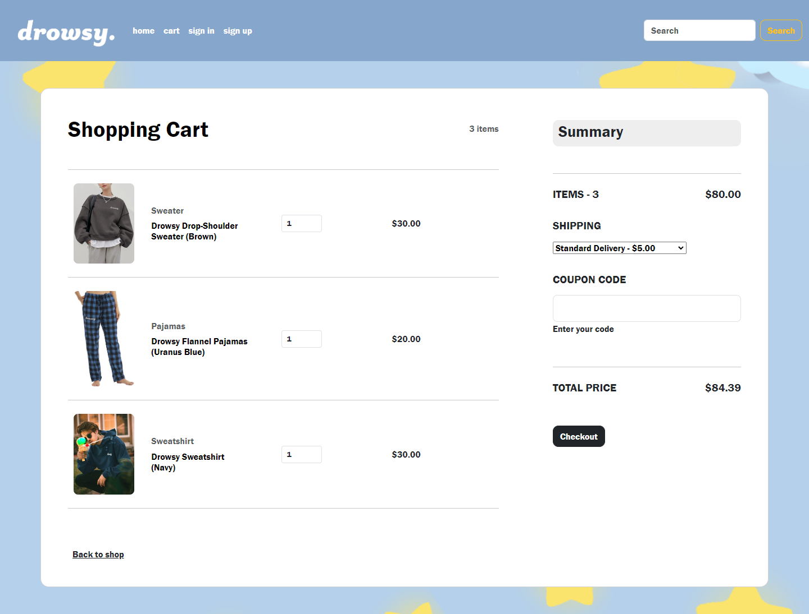

# Capstone Project
 Week 2 Capstone Project of "drowsy", an e-commerce site for Mailjard's class

In this project, I created "drowsy", a website that sells comfy clothes that look good, feel great, and makes you lounge at home even better. The color scheme are light colors that you'd find in a child's bedroom that emphasize the "cozy" feeling.

There are 7 main pages in the website.

1) The home page
2) The product pages (which are 6 in total)
3) The cart page
4) The checkout page
5) The purchase confirmation page
6) The sign up page
7) The sign in page

There is also a secret page that includes a GIF of Kirby, the mascot of the video game of the same name, sleeping with calming music from the Pokemon franchise playing over it.

All the images in the website, except the GIFs of Kirby, were all created by me in Clip Studio Paint.

The best accomplishments in the site are definitely the opening scrolling image and the disappearing message telling the user to scroll down.

